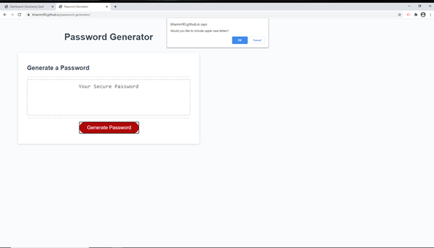
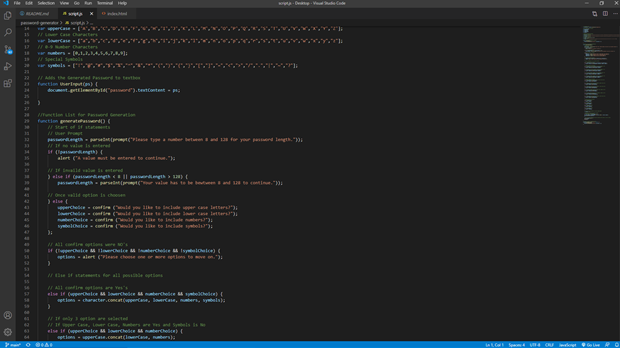

<h1>Password Generator</h1>

<h2>Purpose:</h2>

The purpose of this activity was to use javascript to create a functional password generator. The user should have multiple options to choose from such as the length of the password, whether they would like upper or lower case letter, number and/or symbols in their password. Then by the functions we created in the background the password should appear in the textarea with all the correct criteria.
 

<h2>Task List:</h2>

Deploy a Functional Password Generator to a Webpage
Provide a prompt that finds out the length the user would like.
Provide multiple confirms to find out what options the user would like.
Every prompt needs to have an answer, even invaild options.
Password should auto generate and display in textarea.

<h2>Feedback:</h2>

Feedback and Suggestions are always appreciated! So please feel free to contact me on <a href="https://stackoverflow.com/users/14324130/bhamm90">Stack Overflow</a> with any concerns or suggestions you may have. As for bug fixes I would love to know when you find anything that is causing you to experience issues so I can fix it as soon as possible. If you run into issues please report them here <a href="https://github.com/BHamm90/password-generator/issues"> Please Fix </a> and I will get to them as quick as I can.

<h3>Website Preview:</h3>

<h3>Preview of the Javascript:</h3>

<h3>Looking Forward:</h3>

Looking forward I would like to continue updating this password generator with bug fixes and suggestions given to me by other users. I would as like to see if I can go back and do anything to shorten and clean up the code. Finally I would like to see what other functions are available for use to make this generator more interactive.
 

<footer>© 2020 Trilogy Education Services, a 2U, Inc. brand. All Rights Reserved.</footer>